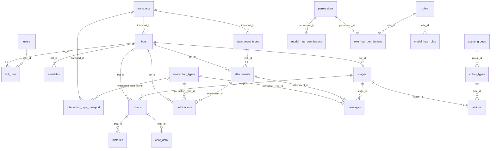

# Описание схемы базы данных (db-schema.png)

Схема представляет реляционную базу данных **платформы для управления чат-ботами**. Включает **25 таблиц**, организованных в несколько логических блоков.

---

## 📋 Оглавление

1. [Ядро платформы](#1-ядро-платформы)
2. [Взаимодействия и сообщения](#2-взаимодействия-и-сообщения)
3. [Чаты и история](#3-чаты-и-история)
4. [Контент и вложения](#4-контент-и-вложения)
5. [Стадии и действия](#5-стадии-и-действия)
6. [Авторизация и роли](#6-авторизация-и-роли)
7. [Инфраструктурные таблицы](#7-инфраструктурные-таблицы)
8. [Диаграмма связей](#8-диаграмма-связей)

---

## 1. Ядро платформы

### 1.1 `transports`

Транспортные каналы (мессенджеры, платформы), через которые работают боты.

| Столбец            | Тип            | Описание                         |
|--------------------|----------------|----------------------------------|
| `name`             | varchar(64)    | Название транспорта              |
| `transport_class`  | varchar(64)    | Класс транспорта (реализация)    |
| `path`             | varchar(255)   | Путь/эндпоинт                    |
| 🔑 `id`            | bigint         | Первичный ключ                   |

---

### 1.2 `bots`

Основная таблица — боты, привязанные к транспортам.

| Столбец              | Тип            | Описание                                     |
|----------------------|----------------|----------------------------------------------|
| `transport_id`       | bigint         | FK → `transports.id`                         |
| `user_name`          | varchar(128)   | Имя пользователя бота                        |
| `token`              | varchar(255)   | Токен авторизации бота                        |
| `can_events`         | boolean        | Поддержка событий                             |
| `can_channels`       | boolean        | Поддержка каналов                             |
| `reset_on_restart`   | boolean        | Сброс состояния при перезапуске               |
| `created_at`         | timestamp(0)   | Дата создания                                 |
| `updated_at`         | timestamp(0)   | Дата обновления                               |
| `hook_confirmation`  | varchar(64)    | Код подтверждения вебхука                     |
| `hook_secret`        | varchar(64)    | Секрет вебхука                                |
| `testing_mode`       | boolean        | Режим тестирования                            |
| `testing_message`    | text           | Тестовое сообщение                            |
| `activation_trigger` | varchar(255)   | Триггер активации                             |
| 🔑 `id`              | bigint         | Первичный ключ                               |

**Связи:**
- `transport_id` → `transports.id`

---

### 1.3 `users`

Пользователи платформы (администраторы, владельцы ботов).

| Столбец             | Тип            | Описание                    |
|---------------------|----------------|-----------------------------|
| `name`              | varchar(255)   | Имя пользователя            |
| `email`             | varchar(255)   | Email                       |
| `email_verified_at` | timestamp(0)   | Дата верификации email       |
| `password`          | varchar(255)   | Хэш пароля                  |
| `remember_token`    | varchar(100)   | Токен "Запомнить меня"       |
| `created_at`        | timestamp(0)   | Дата создания                |
| `updated_at`        | timestamp(0)   | Дата обновления              |
| 🔑 `id`             | bigint         | Первичный ключ              |

---

### 1.4 `bot_user`

Связующая таблица «многие ко многим» между ботами и пользователями.

| Столбец    | Тип    | Описание           |
|------------|--------|--------------------|
| `user_id`  | bigint | FK → `users.id`    |
| `bot_id`   | bigint | FK → `bots.id`     |

**Связи:**
- `user_id` → `users.id`
- `bot_id` → `bots.id`

---

### 1.5 `variables`

Переменные (настройки), привязанные к ботам.

| Столбец         | Тип          | Описание                           |
|-----------------|--------------|-------------------------------------|
| `show_in_table` | boolean      | Показывать в таблице               |
| `position`      | integer      | Порядок отображения                |
| `title`         | varchar(64)  | Заголовок переменной               |
| 🔑 `id`         | varchar(32)  | Первичный ключ (строковый)         |
| `bot_id`        | bigint       | FK → `bots.id`                     |

**Связи:**
- `bot_id` → `bots.id`

---

## 2. Взаимодействия и сообщения

### 2.1 `interaction_types`

Типы взаимодействий (текст, кнопка, форма и т.д.).

| Столбец | Тип          | Описание                    |
|---------|--------------|-----------------------------|
| `name`  | varchar(255) | Название типа взаимодействия |
| 🔑 `id` | varchar(32)  | Первичный ключ (строковый)  |

---

### 2.2 `interaction_type_transport`

Связь типов взаимодействий с транспортами (какие типы поддерживаются каким транспортом).

| Столбец                    | Тип          | Описание                             |
|----------------------------|--------------|--------------------------------------|
| `interaction_type_string`  | varchar(32)  | FK → `interaction_types.id`          |
| `transport_id`             | bigint       | FK → `transports.id`                 |

**Связи:**
- `interaction_type_string` → `interaction_types.id`
- `transport_id` → `transports.id` (через `bot_id`)

---

### 2.3 `notifications`

Уведомления, отправляемые ботами.

| Столбец              | Тип            | Описание                          |
|----------------------|----------------|-----------------------------------|
| `bot_id`             | bigint         | FK → `bots.id`                    |
| `send_at`            | timestamp(0)   | Время отправки                    |
| `delay`              | integer        | Задержка перед отправкой           |
| `message`            | text           | Текст уведомления                 |
| `attachment_id`      | bigint         | FK → `attachments.id`             |
| `interaction_type_id`| varchar(32)    | FK → `interaction_types.id`       |
| `interaction_data`   | text           | Данные взаимодействия              |
| `created_at`         | timestamp(0)   | Дата создания                     |
| `updated_at`         | timestamp(0)   | Дата обновления                   |
| 🔑 `id`              | bigint         | Первичный ключ                    |

**Связи:**
- `bot_id` → `bots.id` (через ключ: `key, bot_id, bot_id`)
- `attachment_id` → `attachments.id`
- `interaction_type_id` → `interaction_types.id`

---

### 2.4 `messages`

Сообщения внутри стадий (этапов) бота.

| Столбец              | Тип            | Описание                          |
|----------------------|----------------|-----------------------------------|
| `stage_id`           | char(26)       | FK → `stages.id`                  |
| `message`            | text           | Текст сообщения                   |
| `position`           | integer        | Позиция в последовательности      |
| `attachment_id`      | bigint         | FK → `attachments.id`             |
| `created_at`         | timestamp(0)   | Дата создания                     |
| `updated_at`         | timestamp(0)   | Дата обновления                   |
| `interaction_type_id`| varchar(32)    | FK → `interaction_types.id`       |
| `interaction_data`   | text           | Данные взаимодействия              |
| 🔑 `id`              | bigint         | Первичный ключ                    |

**Связи:**
- `stage_id` → `stages.id`
- `attachment_id` → `attachments.id`
- `interaction_type_id` → `interaction_types.id`

---

## 3. Чаты и история

### 3.1 `chats`

Чаты (сессии общения пользователей с ботами).

| Столбец                 | Тип            | Описание                              |
|-------------------------|----------------|---------------------------------------|
| `ext_id`                | varchar(255)   | Внешний ID чата (из мессенджера)      |
| `stage_id`              | char(26)       | FK → `stages.id` (текущая стадия)     |
| `first_name`            | varchar(255)   | Имя пользователя                      |
| `last_name`             | varchar(255)   | Фамилия пользователя                  |
| `user_name`             | varchar(255)   | Юзернейм                              |
| `last_message_at`       | timestamp(0)   | Время последнего сообщения            |
| `created_at`            | timestamp(0)   | Дата создания                         |
| `updated_at`            | timestamp(0)   | Дата обновления                       |
| `bot_id`                | bigint         | FK → `bots.id`                        |
| `stage_iteration_count` | integer        | Счётчик итераций стадии               |
| `tester`                | boolean        | Флаг тестового пользователя           |
| `active`                | boolean        | Флаг активности                       |
| 🔑 `id`                 | bigint         | Первичный ключ                        |

**Связи:**
- `stage_id` → `stages.id`
- `bot_id` → `bots.id`

---

### 3.2 `histories`

История сообщений в чатах.

| Столбец      | Тип            | Описание                      |
|--------------|----------------|-------------------------------|
| `created_at` | timestamp(0)   | Дата создания записи          |
| `chat_id`    | bigint         | FK → `chats.id`               |
| `outbound`   | boolean        | Исходящее (true) / входящее   |
| `type`       | integer        | Тип сообщения                 |
| `message`    | text           | Текст сообщения               |
| `stage_id`   | char(26)       | FK → `stages.id`              |
| 🔑 `id`      | bigint         | Первичный ключ                |

**Связи:**
- `chat_id` → `chats.id`

---

### 3.3 `chat_data`

Данные (ключ-значение), привязанные к чатам.

| Столбец      | Тип             | Описание                    |
|--------------|-----------------|-----------------------------|
| `key`        | varchar(32)     | Ключ                        |
| `value`      | varchar(1024)   | Значение                    |
| `created_at` | timestamp(0)    | Дата создания               |
| `updated_at` | timestamp(0)    | Дата обновления             |
| `chat_id`    | bigint          | FK → `chats.id`             |
| `bot_id`     | integer         | ID бота                     |
| 🔑 `id`      | bigint          | Первичный ключ              |

**Связи:**
- `chat_id` → `chats.id`

---

## 4. Контент и вложения

### 4.1 `attachment_types`

Типы вложений (изображение, видео, документ и т.д.).

| Столбец        | Тип            | Описание                      |
|----------------|----------------|-------------------------------|
| `transport_id` | bigint         | FK → `transports.id`          |
| `name`         | varchar(255)   | Название типа                 |
| 🔑 `id`        | varchar(32)    | Первичный ключ (строковый)    |

**Связи:**
- `transport_id` → `transports.id`

---

### 4.2 `attachments`

Вложения (файлы, медиа), привязанные к ботам.

| Столбец      | Тип            | Описание                         |
|--------------|----------------|----------------------------------|
| `type_id`    | varchar(32)    | FK → `attachment_types.id`       |
| `url`        | varchar(255)   | URL файла                        |
| `access_key` | varchar(255)   | Ключ доступа                     |
| `owner_id`   | varchar(255)   | ID владельца                     |
| `album_id`   | varchar(255)   | ID альбома                       |
| `ext_id`     | varchar(255)   | Внешний ID                       |
| `created_at` | timestamp(0)   | Дата создания                    |
| `updated_at` | timestamp(0)   | Дата обновления                  |
| `bot_id`     | bigint         | FK → `bots.id`                   |
| `file`       | varchar(255)   | Путь к файлу                     |
| `preview`    | text           | Превью (base64 или текст)        |
| 🔑 `id`      | bigint         | Первичный ключ                   |

**Связи:**
- `type_id` → `attachment_types.id`
- `bot_id` → `bots.id`

---

## 5. Стадии и действия

### 5.1 `stages`

Стадии (этапы) диалогового сценария бота.

| Столбец       | Тип            | Описание                       |
|---------------|----------------|--------------------------------|
| `bot_id`      | bigint         | FK → `bots.id`                 |
| `description` | varchar(255)   | Описание стадии                |
| `is_initial`  | boolean        | Начальная стадия               |
| `created_at`  | timestamp(0)   | Дата создания                  |
| `updated_at`  | timestamp(0)   | Дата обновления                |
| 🔑 `id`       | varchar(26)    | Первичный ключ (ULID/строка)   |

**Связи:**
- `bot_id` → `bots.id`

---

### 5.2 `action_groups`

Группы действий.

| Столбец | Тип          | Описание              |
|---------|--------------|-----------------------|
| `name`  | varchar(64)  | Название группы       |
| 🔑 `id` | bigint       | Первичный ключ        |

---

### 5.3 `action_types`

Типы действий, привязанные к группам.

| Столбец    | Тип            | Описание                     |
|------------|----------------|------------------------------|
| `name`     | varchar(255)   | Название типа действия       |
| `group_id` | bigint         | FK → `action_groups.id`      |
| 🔑 `id`    | varchar(32)    | Первичный ключ (строковый)   |

**Связи:**
- `group_id` → `action_groups.id`

---

### 5.4 `actions`

Конкретные действия, привязанные к стадиям.

| Столбец      | Тип            | Описание                          |
|--------------|----------------|-----------------------------------|
| `stage_id`   | char(26)       | FK → `stages.id`                  |
| `type_id`    | varchar(32)    | FK → `action_types.id`            |
| `data`       | text           | Данные/параметры действия         |
| `created_at` | timestamp(0)   | Дата создания                     |
| `updated_at` | timestamp(0)   | Дата обновления                   |
| `sort`       | integer        | Порядок сортировки                |
| 🔑 `id`      | bigint         | Первичный ключ                    |

**Связи:**
- `stage_id` → `stages.id`
- `type_id` → `action_types.id`

---

## 6. Авторизация и роли

### 6.1 `permissions`

Разрешения (права доступа).

| Столбец      | Тип            | Описание           |
|--------------|----------------|--------------------|
| `name`       | varchar(255)   | Название           |
| `guard_name` | varchar(255)   | Имя guard'а        |
| `created_at` | timestamp(0)   | Дата создания      |
| `updated_at` | timestamp(0)   | Дата обновления    |
| 🔑 `id`      | bigint         | Первичный ключ     |

---

### 6.2 `roles`

Роли пользователей.

| Столбец      | Тип            | Описание           |
|--------------|----------------|--------------------|
| `name`       | varchar(255)   | Название роли      |
| `guard_name` | varchar(255)   | Имя guard'а        |
| `created_at` | timestamp(0)   | Дата создания      |
| `updated_at` | timestamp(0)   | Дата обновления    |
| 🔑 `id`      | bigint         | Первичный ключ     |

---

### 6.3 `model_has_permissions`

Связь моделей (пользователей) с разрешениями.

| Столбец        | Тип            | Описание                    |
|----------------|----------------|-----------------------------|
| `permission_id`| bigint         | FK → `permissions.id`       |
| `model_type`   | varchar(255)   | Тип модели (полиморфизм)    |
| `model_id`     | bigint         | ID модели                   |

**Связи:**
- `permission_id` → `permissions.id`

---

### 6.4 `role_has_permissions`

Связь ролей с разрешениями.

| Столбец        | Тип    | Описание                    |
|----------------|--------|-----------------------------|
| `permission_id`| bigint | FK → `permissions.id`       |
| `role_id`      | bigint | FK → `roles.id`             |

**Связи:**
- `permission_id` → `permissions.id`
- `role_id` → `roles.id`

---

### 6.5 `model_has_roles`

Связь моделей (пользователей) с ролями.

| Столбец      | Тип            | Описание                    |
|--------------|----------------|-----------------------------|
| `role_id`    | bigint         | FK → `roles.id`             |
| `model_type` | varchar(255)   | Тип модели (полиморфизм)    |
| `model_id`   | bigint         | ID модели                   |

**Связи:**
- `role_id` → `roles.id`

---

## 7. Инфраструктурные таблицы

### 7.1 `personal_access_tokens`

Персональные токены доступа (Laravel Sanctum).

| Столбец          | Тип            | Описание                    |
|------------------|----------------|-----------------------------|
| `tokenable_type` | varchar(255)   | Тип токенизируемой модели   |
| `tokenable_id`   | bigint         | ID модели                   |
| `name`           | varchar(255)   | Название токена             |
| `token`          | varchar(64)    | Хэш токена                  |
| `abilities`      | text           | Разрешения токена            |
| `last_used_at`   | timestamp(0)   | Последнее использование     |
| `expires_at`     | timestamp(0)   | Дата истечения               |
| `created_at`     | timestamp(0)   | Дата создания               |
| `updated_at`     | timestamp(0)   | Дата обновления             |
| 🔑 `id`          | bigint         | Первичный ключ              |

---

### 7.2 `failed_jobs`

Очередь неудачных задач (Laravel Queue).

| Столбец      | Тип            | Описание                 |
|--------------|----------------|--------------------------|
| `uuid`       | varchar(255)   | UUID задачи              |
| `connection` | text           | Тип подключения          |
| `queue`      | text           | Название очереди         |
| `payload`    | text           | Полезная нагрузка        |
| `exception`  | text           | Текст исключения         |
| `failed_at`  | timestamp(0)   | Время ошибки             |
| 🔑 `id`      | bigint         | Первичный ключ           |

---

### 7.3 `password_reset_tokens`

Токены сброса пароля.

| Столбец      | Тип            | Описание              |
|--------------|----------------|-----------------------|
| `token`      | varchar(255)   | Токен                 |
| `created_at` | timestamp(0)   | Дата создания         |
| 🔑 `email`   | varchar(255)   | Email (первичный ключ)|

---

### 7.4 `migrations`

Таблица миграций (Laravel).

| Столбец     | Тип            | Описание             |
|-------------|----------------|----------------------|
| `migration` | varchar(255)   | Имя миграции         |
| `batch`     | integer        | Номер пакета         |
| 🔑 `id`     | integer        | Первичный ключ       |

---

## 8. Диаграмма связей

---

## 📝 Общие замечания

1. **Фреймворк**: Структура таблиц указывает на использование **Laravel** (PHP) — наличие `migrations`, `failed_jobs`, `personal_access_tokens`, `password_reset_tokens`, полиморфные связи `model_type`/`model_id`.

2. **Права доступа**: Используется пакет **Spatie Laravel Permission** (таблицы `roles`, `permissions`, `model_has_roles`, `model_has_permissions`, `role_has_permissions` с `guard_name`).

3. **ID стадий**: Таблица `stages` использует `varchar(26)` в качестве первичного ключа — это формат **ULID** (Universally Unique Lexicographically Sortable Identifier).

4. **Полиморфные связи**: Таблицы `model_has_roles`, `model_has_permissions`, `personal_access_tokens` используют полиморфизм Laravel (`model_type` + `model_id` / `tokenable_type` + `tokenable_id`).

5. **Временные метки**: Большинство таблиц имеют стандартные поля `created_at` / `updated_at` с типом `timestamp(0)`.

6. **Основная бизнес-логика**: Сценарии чат-ботов строятся на цепочке `bots` → `stages` → `messages`/`actions`, где пользовательские сессии отслеживаются через `chats` → `histories`.
